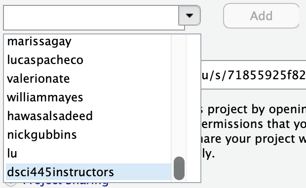

# hw-7

Homework 7 in DSCI445: Statistical Machine Learning @ CSU

## Assignment

Be sure to `set.seed(445)`.

1. Consider the `USArrests` data. We will now perform hierarchical clustering on the states.

    a) Using hierarchical clustering with complete linkage and Euclidean distance, cluster the states.
    
    b) Cut the dendrogram at a height that results in three distinct clusters. Which states belong to which clusters?
    
    c) Hierarchically cluster the states using complete linkage and Euclidean distance, *after scaling the variables to have standard deviation one*.
    
    d) What affect does scaling the variables have on the hierarchical clusters obtained? In your opinion, should the variables be scaled before the inter-observation dissimilarities are computed? Provide a justification for your answer.
    
2. In this problem you will generate simulated data and then perform PCA and $K$-means clustering on the data. First run the following to obtain the data.

    
    ```r
    library(mvtnorm)
    
    n <- 20
    p <- 10
    x <- rmvnorm(n*3, rep(0, p))
    
    # shift means
    x[seq_len(n), ] <- x[seq_len(n), ] + matrix(rep(runif(p, min = 1, max = 3), n), nrow = n, byrow = TRUE)
    x[seq_len(n) + 2*n, ] <- x[seq_len(n) + 2*n, ] + matrix(rep(runif(p, min = -3, max = -1), n), nrow = n, byrow = TRUE)
    
    # add class labels
    y <- c(rep("-1", n), rep("0", n), rep("1", n))
    ```
    
    a) Perform PCA on the $60$ observations and plot the first two principal comonent score vectors. Use a different color to indicate the observations in each of the true classes (`y`).
    
    b) Perform $K$ means clustering of the observations with $K = 3$. How well do the clusters you obtained in $K$-means clustering compare to the true class labels? (**Hint:** `table()` may be useful here.)
    
    c) Perform $K$ means clustering of the observations with $K = 2$.  Describe your results.
    
    d) Perform $K$ means clustering of the observations with $K = 4$.  Describe your results.
    
    e) Now perform $K$ means clustering with $K = 3$ on the first two principal components rather than the raw data. Comment on the results.
    
    f) Using the `scale()` function, perform $K$ means clustering with $K = 3$ on the data *after scaling each variable to have standard deviation one*. How do these results compare to those obtained in b)-e)?
    
3. In this folder, there is a data set called `gene_exp.csv` that consists of $40$ tissue samples with measurements on $1,000$ genes. The first $20$ are from healthy patients while the second $20$ are from a diseased group.

    a) Load the data into `R`. Note, there are no headers in the file.
    b) Apply hierarchical clustering to the samples using correlation-based distance and plot the dendrogram. Do the genes separate the samples into the two groups? Do your results depend on the type of linkage used?
    c) Your collaborator wants to know which genes differ the most across the two groups. Suggest a way to answer this question and apply it here.

Turn in in a pdf of your homework to canvas using the provided Rmd file as a template. Your Rmd file on the server will also be used in grading, so be sure they are identical.

**Be sure to share your server project with the instructor and grader. You only need to do this once per semester.**

1. Open your `homeworks` project on liberator.stat.colostate.edu
2. Click the drop down on the project (top right side) > Share Project...
    
    
  
3. Click the drop down and add "dsci445instructors" to your project.

    

This is how you **receive points** for reproducibility on your homework!
